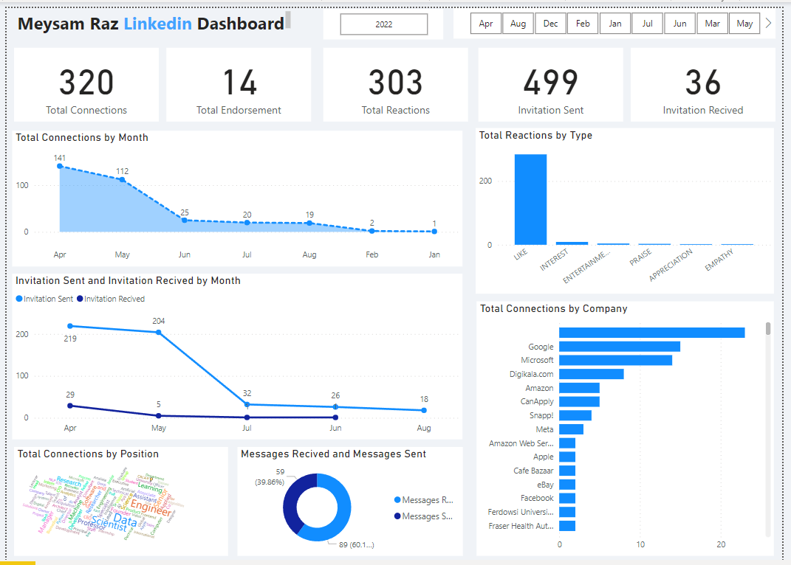

# Linkedin Profile Dashboard Power BI

# Overvirew 

LinkedIn is a very powerful social network for communicating and finding a job. In this project, I tried to analyze my profile using the data provided by LinkedIn. This project is not only for analyzing my profile, and anyone who is active in LinkedIn can Use this dashboard.

I used [Power BI](https://powerbi.microsoft.com/en/) a great data visualisation tool published by microsoft Power BI provied us great Data trasformation tool to transform our data and easily visualize it.

But before i start, I used at the end i used a little python code to understand better data (optional) :)

## Where i get my data :

Fortunately, LinkedIn has a suitable platform for obtaining information about ourselves. That means there is no scraping :)

Open your LinkedIn -> profile -> setting -> data privacy -> Get a copy of your data 

 ### Libraries and packages for python notebook : 
 
 - [pandas](https://pandas.pydata.org/)
